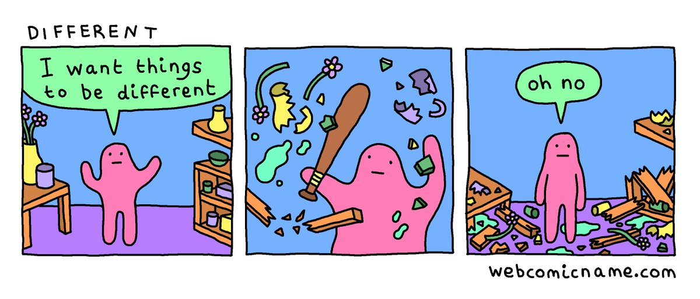

## Culture eats strategy for breakfast

It doesn't matter what tools or processes are in place, if you don't have the culture to support them, people will work outside of those processes and tools.

- Culture is either intentional, or unintentional
- If culture eats strategy for breakfast, then it is too important to be left to chance. It is important to be intentional about the culture you want to adopt and then foster in your organization.

?> **Examples:**   - Company values printed on the back of security badge. - DaVita (Fortune 200 healthcare company) employs a Chief Wisdom Officer, with a team of 90 people who oversee and are intentional about culture.

## ⌨️ Activity: Cultural ingredients

***If none of us is smarter than all of us, then we all have a unique and valuable perspective.***

**Purpose**: To identify cultural ingredients of InnerSource development. _(Time: ~20 minutes)_

!> **Activity question(s)**:   What are some cultural ingredients of InnerSource development?

**Preparation:** _(Time: ~10 minutes)_

1. Separate into small groups and gather ideas on what some cultural ingredients are for InnerSource.

**Present:** _(Time: ~10 minutes)_
2. Report back to the collective group via a nominated group representative.

## Understanding cultural ingredients

Some of the key cultural InnerSource ingredients we see are:
- **Transparency**, both terms of process and participation
- **Engagement**, contributors are highly engaged, often resulting in productive conflict and creative abrasion
- **Asynchronous**, communication is asynchronous, enabling organization wide participation

These cultural ingredients produce a freedom to contribute, central to the success of InnerSource (since, given enough eyeballs, all bugs are shallow).

?> **Linus's Law**:   Linus's law is a claim about software development and named after Linus Torvalds. The law states that, **"given enough eyeballs, all bugs are shallow"**. Meaning, given a enough people to test and review the code, issues and bugs will be characterized and fixed quickly with someone knowing how to fix it.

To understand how to introduce new cultural ingredients, it may be helpful to review the [five dysfunctions of a team](https://en.wikipedia.org/wiki/The_Five_Dysfunctions_of_a_Team), these are:
1. Absence of trust
2. Fear of conflict
3. Lack of commitment
4. Avoidance of accountability
5. Inattention to results

**For example**: If there is an absence of trust, then there will not be any creative abrasion, due to fear of conflict. (Without trust, you can’t have healthy debate and conflict, because people are afraid of being honest with each other)

- To build this productive conflict and creative abrasion, you need to first build trust, to develop psychological safety, so people feel free to be honest with one another.
- If people don’t feel safe out in the open, they’ll find a way around the tools and processes that have been put in place

## The Emperor's new clothes test

Applying this cultural mindset of trust and transparency within an organization, we see the importance for feedback to come from anywhere, as well as the importance of receiving feedback well. Receiving feedback is a gift.

For an example, apply The Emperor's Clothes Test:

Are there ways in the organization that allow a novice (e.g., an intern) to publicly call attention to the emperor’s (i.e., the expert’s) lack of clothes (i.e., to raise quality issues), or does all internal communication addressed to a larger audience have to go through gatekeepers?

!> **Discussion Question(s):**   Does this feel achievable, or insurmountable? 
Has there been any situations, positive or negative, that revolve around this situation?

### Creative abrasion

Also important to InnerSource is the value that ideas are evaluated on their merits alone, often resulting in this creative abrasion.
- Similar to this, Jim Whitehurst argues in book, **The Open Organization**, you want an organization that disagrees with you.
- In addition, **Pixar's Brain Trust** is a great example of creative abrasion.
- This is not the same, however, as interpersonal conflict.

## ⌨️ Activity: Cultural resistance

!> **Activity question(s)**:  How does this style fit with your current culture? What resistance is this likely to be met with? Do constraints exist that limit openness?

**Purpose**: To identify areas of cultural improvement. _(Time: ~20 minutes)_

**Preparation:** _(Time: ~10 minutes)_

1. Separate into small groups and discuss cultural resistance or limitations within your organization.

**Present:** _(Time: ~10 minutes)_
2. Report back to the collective group via a nominated group representative.

## Start with small changes

So, where to start?
- Overcome fear and develop trust through controlled exposures
- Start small, don't change everything at once

!> **Discussion question(s)**:  What are some small changes you can introduce so team members feel safe collaborating in the open?

### Suggestion example

Set up a GitHub Pages site on your GitHub Enterprise instance, and get developers blogging, publishing posts via pull requests leveraging the GitHub Flow.

Benefits of this approach include:
- Working on a non-production, non-commercial environment.
- Increasing comfort with sharing ideas and feedback with one another through hands-on practice.
- Developing a habit around the important practice of writing things down.
- Applying the GitHub Flow, which we consider to be an ideal workflow to strive for in any development environment.
- Leveraging continuous integration (CI), lowering contributor friction, and allowing reviews to focus on substance.

## Checklist

### group activity around different culture situations
